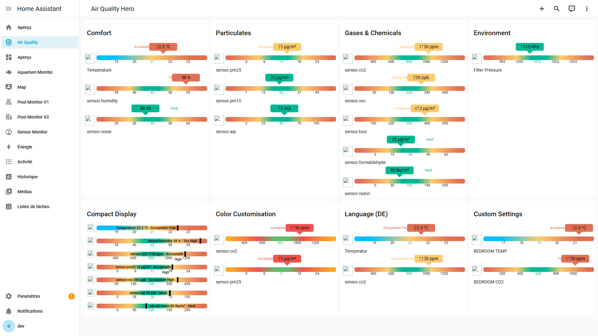
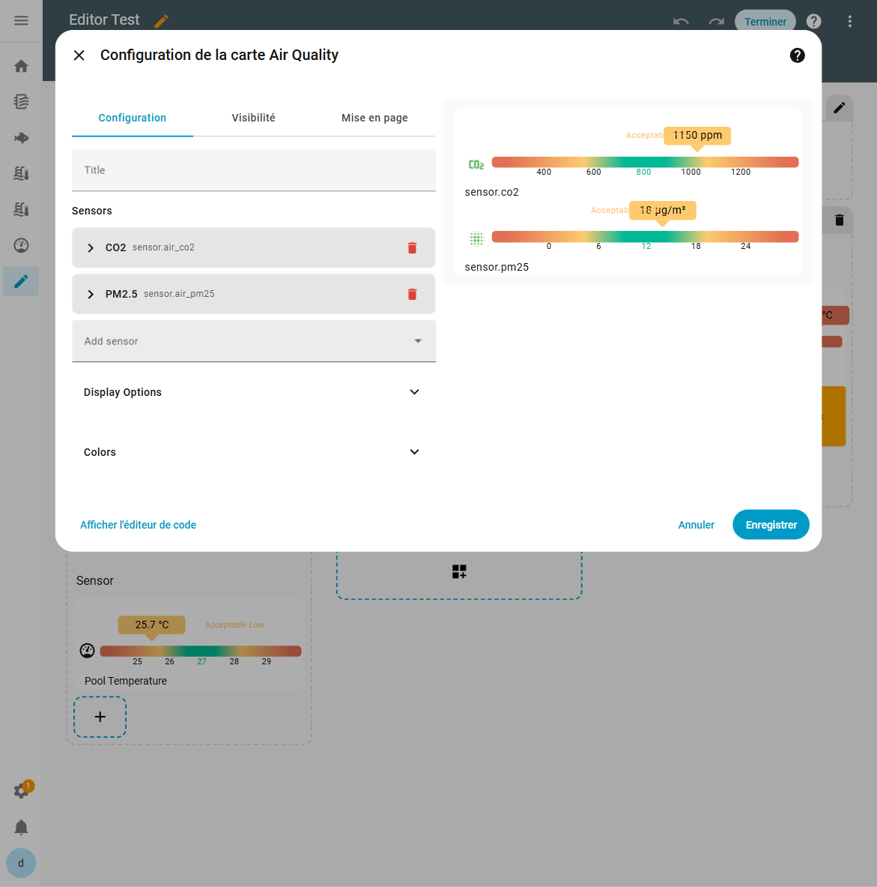

# Air Quality Card

[![Release][release-shield]][release-link] [![HACS][hacs-shield]][hacs-link] [![GitHub Activity][commits-shield]][commits-link]

> Visualize the air you breathe — track pollutants, comfort, and health indicators in every room of your home.
>
> **Visual editor included** — configure everything from the UI, no YAML needed.



---

## Why this card?

Indoor air can be **2-5× more polluted** than outdoor air. Most people spend 90% of their time indoors, yet few monitor what they're breathing.

This card monitors up to **12 parameters** from popular sensors like Airthings, Xiaomi, SCD40, and Ikea Vindstyrka.

See at a glance if CO2 is climbing in your bedroom, if VOCs spike after cooking, or if particulate levels are safe for your family.

### What you can do

- Monitor CO2 in bedrooms to **improve sleep quality** (open a window when it climbs)
- Track PM2.5 during **wildfire season** or high pollen days
- Detect VOC spikes from **cleaning products, paint, or new furniture**
- Verify your **ventilation system** (MVHR/HRV) is actually working
- Monitor radon levels in **basements** for long-term health protection

---

## Sensors (12 presets)

Every sensor comes with **preset ideal ranges** — just point to your entity and the card handles the rest. Override any value to match your setup.

### Comfort

*Temperature, humidity, and noise directly affect how comfortable you feel at home.*

  

| Sensor | Key | Unit | Default Setpoint |
|--------|-----|------|:----------------:|
| Temperature | `temperature` | °C | 21 |
| Humidity | `humidity` | % | 45 |
| Noise Level | `noise` | dB | 40 |

### Particulates

*Fine particles penetrate deep into lungs. PM2.5 is the most health-critical air metric.*

  

| Sensor | Key | Unit | Default Setpoint |
|--------|-----|------|:----------------:|
| PM2.5 | `pm25` | µg/m³ | 12 |
| PM10 | `pm10` | µg/m³ | 25 |
| Air Quality Index | `aqi` | AQI | 50 |

### Gases & Chemicals

*CO2 indicates ventilation quality. VOCs and formaldehyde signal chemical pollution.*

    

| Sensor | Key | Unit | Default Setpoint |
|--------|-----|------|:----------------:|
| CO2 | `co2` | ppm | 800 |
| VOC | `voc` | ppb | 250 |
| TVOC | `tvoc` | µg/m³ | 300 |
| Formaldehyde | `formaldehyde` | µg/m³ | 30 |
| Radon | `radon` | Bq/m³ | 100 |

### Environment

*Atmospheric pressure changes can trigger migraines and affect weather-sensitive people.*


| Sensor | Key | Unit | Default Setpoint |
|--------|-----|------|:----------------:|
| Atmospheric Pressure | `pressure` | hPa | 1013 |

For detailed explanations of each sensor and why it matters, see [Sensor Details](docs/sensors.md).

---

## Compatible Hardware

Community-tested devices that work with this card:

| Device | Integration | Description |
|--------|-------------|-------------|
| Airthings Wave Plus / View Plus | Airthings BLE / Cloud | Radon, CO2, VOC, temperature, humidity, pressure. The gold standard for indoor air. |
| Ikea VINDSTYRKA | ZHA / Zigbee2MQTT | Affordable PM2.5 and TVOC sensor. Zigbee connected. |
| SCD40/SCD41 (via ESPHome) | ESPHome | Accurate CO2, temperature, humidity on an ESP32. DIY-friendly. |
| Xiaomi/Aqara Air Quality Monitor | Xiaomi Miot / ZHA | CO2, PM2.5, temperature, humidity. Affordable and widely available. |
| PurpleAir / SDS011 | ESPHome / REST API | Precise PM2.5/PM10 sensors for outdoor or indoor particulate monitoring. |

> Know a device that works? [Open an issue](https://github.com/wilsto/air-quality-card/issues) to add it!

---

## Installation

### HACS (recommended)

1. Open [HACS](https://hacs.xyz/) → **Frontend** → search for **Air Quality Card**
2. Install and reload your browser

[](https://my.home-assistant.io/redirect/hacs_repository/?owner=wilsto&repository=air-quality-card&category=plugin)

### Manual

1. Download `air-quality-card.js` from the [latest release](https://github.com/wilsto/air-quality-card/releases)
2. Copy to `config/www/community/air-quality-card/`
3. Add resource: `/local/community/air-quality-card/air-quality-card.js` (type: module)

---

## Quick Start

### Visual Editor (recommended)

1. In your dashboard, click **Edit Dashboard** (pencil icon)
2. Click **+ Add Card** → select **Manual** → type `custom:air-quality-card`
3. Click **Show Visual Editor** to configure sensors, display options and colors — no YAML needed



### YAML

```yaml
type: custom:air-quality-card
title: "Living Room Air"
sensors:
  temperature:
    entity: sensor.your_temperature_sensor
  co2:
    entity: sensor.your_co2_sensor
  pm25:
    entity: sensor.your_pm25_sensor
```

That's it! The card uses sensible defaults for everything else.

---

## Configuration

> All options below are also available in the visual editor.

| Option | Type | Default | Description |
|--------|------|---------|-------------|
| `title` | string | — | Card title |
| `sensors` | object | — | Sensor definitions (see below) |
| `display.compact` | boolean | `false` | Compact display mode |
| `display.show_names` | boolean | `true` | Show sensor names |
| `display.show_icons` | boolean | `true` | Show sensor icons |
| `display.show_units` | boolean | `true` | Show units |
| `display.show_labels` | boolean | `true` | Show range labels |
| `display.gradient` | boolean | `true` | Show gradient bar |
| `display.show_last_updated` | boolean | `false` | Show last update time |
| `display.show_icons` | boolean | `true` | Show sensor icons |
| `language` | string | `en` | Language code |

### Per-sensor overrides

```yaml
sensors:
  temperature:
    entity: sensor.xxx        # required
    name: Custom Name         # override display name
    unit: "°C"                # override unit
    setpoint: 25              # ideal value
    min: 10                   # min of the range
    max: 40                   # max of the range
    step: 2                   # threshold step for colors
    icon: mdi:thermometer     # MDI icon
    mode: centric             # centric | heatflow
```

### Multiple sensors of the same type

```yaml
sensors:
  temperature:
    - entity: sensor.sensor_1
      name: Location 1
    - entity: sensor.sensor_2
      name: Location 2
```

### Languages

12 languages supported: 🇬🇧 English, 🇫🇷 French, 🇩🇪 German, 🇪🇸 Spanish, 🇮🇹 Italian, 🇵🇹 Portuguese, 🇳🇱 Dutch, 🇵🇱 Polish, 🇨🇿 Czech, 🇸🇰 Slovak, 🇮🇱 Hebrew, 🇷🇺 Russian.

---

## Support

[](https://bmc.link/wilsto)

## Monitor Cards Family

This card is part of the **monitor-cards** family — same rendering engine, same features, different presets:

| Card | For | Sensors |
|------|-----|---------|
| [Pool Monitor Card](https://github.com/wilsto/pool-monitor-card) | Pool & spa owners | 21 presets |
| [Aquarium Monitor Card](https://github.com/wilsto/aquarium-monitor-card) | Freshwater & saltwater aquarium keepers | 15 presets |
| [Air Quality Card](https://github.com/wilsto/air-quality-card) | Homeowners concerned about indoor air quality | 12 presets ← *you are here* |
| [Sensor Monitor Card](https://github.com/wilsto/sensor-monitor-card) | Home Assistant power users | unlimited (custom) |

<!-- Badges -->
[release-shield]: https://img.shields.io/github/v/release/wilsto/air-quality-card?style=flat-square
[release-link]: https://github.com/wilsto/air-quality-card/releases/latest
[hacs-shield]: https://img.shields.io/badge/HACS-Default-orange.svg?style=flat-square
[hacs-link]: https://hacs.xyz/
[commits-shield]: https://img.shields.io/github/commit-activity/y/wilsto/air-quality-card?style=flat-square
[commits-link]: https://github.com/wilsto/air-quality-card/commits/main