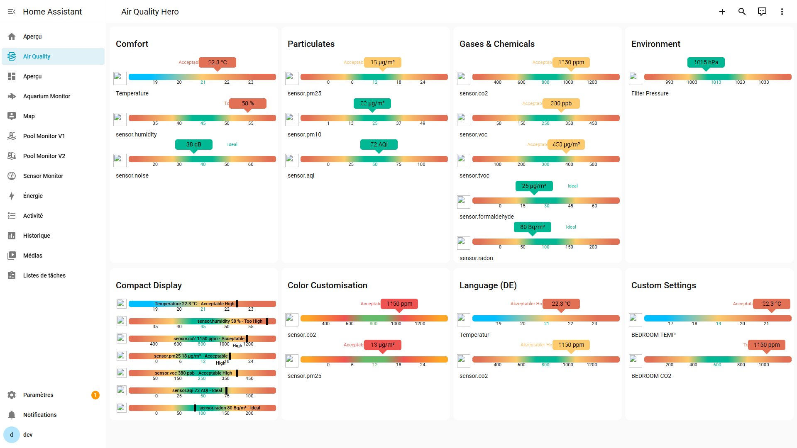

# Air Quality Card

[![Release][release-shield]][release-link] [![HACS][hacs-shield]][hacs-link] [![GitHub Activity][commits-shield]][commits-link]

> Visualize the air you breathe — track pollutants, comfort, and health indicators in every room of your home.



---

## Why this card?

Indoor air can be **2-5× more polluted** than outdoor air. Most people spend 90% of their time indoors, yet few monitor what they're breathing.

This card monitors up to **12 parameters** from popular sensors like Airthings, Xiaomi, SCD40, and Ikea Vindstyrka.

See at a glance if CO2 is climbing in your bedroom, if VOCs spike after cooking, or if particulate levels are safe for your family.

### What you can do

- Monitor CO2 in bedrooms to **improve sleep quality** (open a window when it climbs)
- Track PM2.5 during **wildfire season** or high pollen days
- Detect VOC spikes from **cleaning products, paint, or new furniture**
- Verify your **ventilation system** (MVHR/HRV) is actually working
- Monitor radon levels in **basements** for long-term health protection

---

## Sensors (12 presets)

Every sensor comes with **preset ideal ranges** — just point to your entity and the card handles the rest. Override any value to match your setup.

### Comfort

*Temperature, humidity, and noise directly affect how comfortable you feel at home.*

  

| Sensor | Key | Unit | Default Setpoint |
|--------|-----|------|:----------------:|
| Temperature | `temperature` | °C | 21 |
| Humidity | `humidity` | % | 45 |
| Noise Level | `noise` | dB | 40 |

### Particulates

*Fine particles penetrate deep into lungs. PM2.5 is the most health-critical air metric.*

  

| Sensor | Key | Unit | Default Setpoint |
|--------|-----|------|:----------------:|
| PM2.5 | `pm25` | µg/m³ | 12 |
| PM10 | `pm10` | µg/m³ | 25 |
| Air Quality Index | `aqi` | AQI | 50 |

### Gases & Chemicals

*CO2 indicates ventilation quality. VOCs and formaldehyde signal chemical pollution.*

    

| Sensor | Key | Unit | Default Setpoint |
|--------|-----|------|:----------------:|
| CO2 | `co2` | ppm | 800 |
| VOC | `voc` | ppb | 250 |
| TVOC | `tvoc` | µg/m³ | 300 |
| Formaldehyde | `formaldehyde` | µg/m³ | 30 |
| Radon | `radon` | Bq/m³ | 100 |

### Environment

*Atmospheric pressure changes can trigger migraines and affect weather-sensitive people.*


| Sensor | Key | Unit | Default Setpoint |
|--------|-----|------|:----------------:|
| Atmospheric Pressure | `pressure` | hPa | 1013 |

For detailed explanations of each sensor and why it matters, see [Sensor Details](docs/sensors.md).

---

## Compatible Hardware

Community-tested devices that work with this card:

| Device | Integration | Description |
|--------|-------------|-------------|
| Airthings Wave Plus / View Plus | Airthings BLE / Cloud | Radon, CO2, VOC, temperature, humidity, pressure. The gold standard for indoor air. |
| Ikea VINDSTYRKA | ZHA / Zigbee2MQTT | Affordable PM2.5 and TVOC sensor. Zigbee connected. |
| SCD40/SCD41 (via ESPHome) | ESPHome | Accurate CO2, temperature, humidity on an ESP32. DIY-friendly. |
| Xiaomi/Aqara Air Quality Monitor | Xiaomi Miot / ZHA | CO2, PM2.5, temperature, humidity. Affordable and widely available. |
| PurpleAir / SDS011 | ESPHome / REST API | Precise PM2.5/PM10 sensors for outdoor or indoor particulate monitoring. |

> Know a device that works? [Open an issue](https://github.com/wilsto/air-quality-card/issues) to add it!

---

## Installation

### HACS (recommended)

1. Open [HACS](https://hacs.xyz/) → **Frontend** → search for **Air Quality Card**
2. Install and reload your browser

[](https://my.home-assistant.io/redirect/hacs_repository/?owner=wilsto&repository=air-quality-card&category=plugin)

### Manual

1. Download `air-quality-card.js` from the [latest release](https://github.com/wilsto/air-quality-card/releases)
2. Copy to `config/www/community/air-quality-card/`
3. Add resource: `/local/community/air-quality-card/air-quality-card.js` (type: module)

---

## Quick Start

```yaml
type: custom:air-quality-card
title: "Living Room Air"
sensors:
  temperature:
    entity: sensor.your_temperature_sensor
  co2:
    entity: sensor.your_co2_sensor
  pm25:
    entity: sensor.your_pm25_sensor
```

That's it! The card uses sensible defaults for everything else.

---

## Configuration

| Option | Type | Default | Description |
|--------|------|---------|-------------|
| `title` | string | — | Card title |
| `sensors` | object | — | Sensor definitions (see below) |
| `display.compact` | boolean | `false` | Compact display mode |
| `display.show_names` | boolean | `true` | Show sensor names |
| `display.show_icons` | boolean | `true` | Show sensor icons |
| `display.show_units` | boolean | `true` | Show units |
| `display.show_labels` | boolean | `true` | Show range labels |
| `display.gradient` | boolean | `true` | Show gradient bar |
| `display.show_last_updated` | boolean | `false` | Show last update time |
| `display.show_icons` | boolean | `true` | Show sensor icons |
| `language` | string | `en` | Language code |

### Per-sensor overrides

```yaml
sensors:
  temperature:
    entity: sensor.xxx        # required
    name: Custom Name         # override display name
    unit: "°C"                # override unit
    setpoint: 25              # ideal value
    min: 10                   # number = scale bound, string = tracking entity
    max: 40                   # same
    step: 2                   # threshold step for colors
    icon: mdi:thermometer     # MDI icon
    mode: centric             # centric | heatflow
```

`min` and `max` accept two forms and the type decides: a **number** is a bound
of the visible scale, a **string** is an entity whose value places a tracking
marker on the bar.

Without them, the bar spans `setpoint ± 3 × step`, and the coloured zones
change every `step`. So `step` is what widens or narrows the green zone —
a larger `step` is more tolerant, a smaller one more strict.

### Quantities whose ideal is at one end

`centric` and `heatflow` both place the ideal value in the middle. For PM2.5,
where 0 is best, or ORP, where higher is better, give the four class
boundaries explicitly and say which way the scale reads:

```yaml
sensors:
  pm25:
    entity: sensor.pm25
    min: 0
    max: 20
    limits: [2, 5, 10, 15]    # four boundaries, replaces setpoint/step
    # direction: lower_is_better (default) | higher_is_better
```

### Multiple sensors of the same type

```yaml
sensors:
  temperature:
    - entity: sensor.sensor_1
      name: Location 1
    - entity: sensor.sensor_2
      name: Location 2
```

### Styling

The card renders a standard `ha-card`, so it responds to your Home Assistant
theme and to [card-mod](https://github.com/thomasloven/lovelace-card-mod) like
any other card.

**Transparent, borderless:**

```yaml
type: custom:air-quality-card
card_mod:
  style: |
    ha-card {
      background: transparent;
      box-shadow: none;
      border: none;
    }
sensors: ...
```

**Sizes, colours, spacing** — target the classes below:

```yaml
card_mod:
  style: |
    .pool-monitor-title { font-size: 2rem !important; }
    .entity-icon { color: var(--error-color); }
    .gauge-scale { font-size: 1.1em !important; }
```

> **Why some rules need `!important`.** The card ships its styles as an
> adopted stylesheet, and those win over an injected one at equal
> specificity. So a property the card already sets — a font size, a bar
> height — needs `!important` or a more specific selector such as
> `h1.pool-monitor-title`. A property the card does **not** set, like the
> icon colour above, applies with no ceremony. Styling `ha-card` itself
> also works plainly: that rule crosses a shadow boundary, where the
> outer stylesheet wins.

| Class | What it is |
| --- | --- |
| `.pool-monitor-title` | Card title |
| `.entity-icon` / `.entity-icon-compact` | Sensor icon, normal and compact modes |
| `.gauge-scale` | Row of numbers under the bar |
| `.grid-item-text-box` | Sensor name and value |
| `.status-badge` | Status badge |
| `.battery-indicator` | Battery level indicator |
| `.progress-bar-child` | The coloured bar itself |
| `.cursor` / `.cursor-text` | Current-value marker and its label |

> Marker positions and colours are computed per reading and set inline, so
> they follow the sensor value rather than a stylesheet. Everything listed
> above is static and can be overridden.

### Languages

15 languages supported: Čeština, Deutsch, English, Español, Français, עברית, Magyar, Italiano, Nederlands, Português, Português (Brasil), Română, Русский, Slovenčina, Svenska.

Set one with `display.language`, or pick it in the visual editor.

---

## Support

[](https://bmc.link/wilsto)

## Monitor Cards Family

This card is part of the **monitor-cards** family — same rendering engine, same features, different presets:

| Card | For | Sensors |
|------|-----|---------|
| [Pool Monitor Card](https://github.com/wilsto/pool-monitor-card) | Pool & spa owners | 28 presets |
| [Aquarium Monitor Card](https://github.com/wilsto/aquarium-monitor-card) | Freshwater & saltwater aquarium keepers | 15 presets |
| [Air Quality Card](https://github.com/wilsto/air-quality-card) | Homeowners concerned about indoor air quality | 12 presets ← *you are here* |
| [Sensor Monitor Card](https://github.com/wilsto/sensor-monitor-card) | Home Assistant power users | unlimited (custom) |

<!-- Badges -->
[release-shield]: https://img.shields.io/github/v/release/wilsto/air-quality-card?style=flat-square
[release-link]: https://github.com/wilsto/air-quality-card/releases/latest
[hacs-shield]: https://img.shields.io/badge/HACS-Default-orange.svg?style=flat-square
[hacs-link]: https://hacs.xyz/
[commits-shield]: https://img.shields.io/github/commit-activity/y/wilsto/air-quality-card?style=flat-square
[commits-link]: https://github.com/wilsto/air-quality-card/commits/main