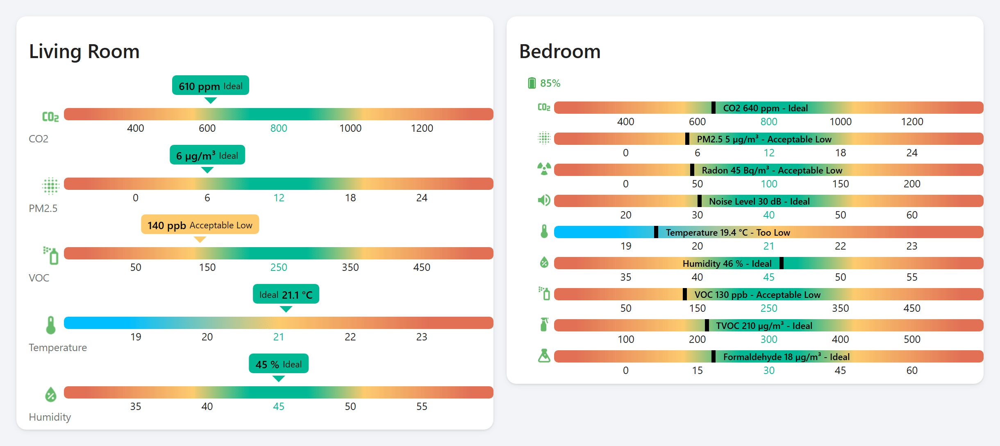
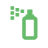

# Air Monitor Card

[![Release][release-shield]][release-link] [![HACS][hacs-shield]][hacs-link] [![GitHub Activity][commits-shield]][commits-link]

> Visualize the air you breathe: track pollutants, comfort, and health indicators in every room of your home.



[See the eight ways to configure this card](example/screenshots.md)

> ### Already using this card? Change the type in your YAML.
>
> ```yaml
> type: custom:air-monitor-card   # was custom:air-quality-card
> ```
>
> Nothing else changes: same sensors, same options, same look. Your existing
> `custom:air-quality-card` keeps working and will keep working, so there is no
> deadline and nothing breaks if you never touch it.
>
> The reason to change is that four cards on GitHub claim the name
> `air-quality-card`, and a browser lets only one of them exist. Install any of
> the others and whichever loads second simply does not appear, with no error to
> explain why. `air-monitor-card` belongs to this card alone, so it cannot happen
> to you.

---

## Why this card?

Indoor air can be **2-5× more polluted** than outdoor air. Most people spend 90% of their time indoors, yet few monitor what they're breathing.

This card monitors up to **12 parameters** from popular sensors like Airthings, Xiaomi, SCD40, and Ikea Vindstyrka.

See at a glance if CO2 is climbing in your bedroom, if VOCs spike after cooking, or if particulate levels are safe for your family.

### What you can do

- Monitor CO2 in bedrooms to **improve sleep quality** (open a window when it climbs)
- Track PM2.5 during **wildfire season** or high pollen days
- Detect VOC spikes from **cleaning products, paint, or new furniture**
- Verify your **ventilation system** (MVHR/HRV) is actually working
- Monitor radon levels in **basements** for long-term health protection

---

## Sensors (15 presets)

Every sensor comes with **preset ideal ranges**: just point to your entity and the card handles the rest. Override any value to match your setup.

### Comfort

*Temperature, humidity, and noise directly affect how comfortable you feel at home.*

  

| Sensor | Key | Unit | Defaults |
|--------|-----|------|:----------------:|
| Temperature | `temperature` | °C | 21 |
| Humidity | `humidity` | % | 45 |
| Noise Level | `noise` | dB | 40 |

### Particulates

*Fine particles penetrate deep into lungs. PM2.5 is the most health-critical air metric.*

  

| Sensor | Key | Unit | Defaults |
|--------|-----|------|:----------------:|
| PM1 | `pm1` | µg/m³ | 15 / 37.5 / 50 / 75 |
| PM2.5 | `pm25` | µg/m³ | 15 / 37.5 / 50 / 75 |
| PM4 | `pm4` | µg/m³ | 15 / 37.5 / 50 / 75 |
| PM10 | `pm10` | µg/m³ | 45 / 75 / 100 / 150 |
| Air Quality Index | `aqi` | AQI | 50 |

### Gases & Chemicals

*CO2 indicates ventilation quality. VOCs and formaldehyde signal chemical pollution.*

    

| Sensor | Key | Unit | Defaults |
|--------|-----|------|:----------------:|
| Carbon Monoxide | `co` | ppm | 6 / 9 / 30 / 87 |
| CO2 | `co2` | ppm | 500 / 800 / 1000 / 2000 |
| VOC | `voc` | ppb | 250 / 500 / 1000 / 2000 |
| TVOC | `tvoc` | µg/m³ | 300 / 1000 / 3000 / 10000 |
| Formaldehyde | `formaldehyde` | µg/m³ | 10 / 30 / 50 / 100 |
| Radon | `radon` | Bq/m³ | 50 / 100 / 150 / 300 |

### Environment

*Atmospheric pressure changes can trigger migraines and affect weather-sensitive people.*


| Sensor | Key | Unit | Defaults |
|--------|-----|------|:----------------:|
| Atmospheric Pressure | `pressure` | hPa | 1013 |

For detailed explanations of each sensor and why it matters, see [Sensor Details](docs/sensors.md).

---

## Compatible Hardware

Community-tested devices that work with this card:

| Device | Integration | Description |
|--------|-------------|-------------|
| [Amazon Smart Air Quality Monitor](https://www.amazon.com/Introducing-Amazon-Smart-Quality-Monitor/dp/B08W8KS8D3) | None native ([request](https://community.home-assistant.io/t/integrate-amazon-smart-air-quality-monitor/435717)) | PM2.5, VOC, carbon monoxide, temperature, humidity. Alexa only, so the readings have to be bridged in. The card gained its CO preset for it. |
| Airthings Wave Plus / View Plus | Airthings BLE / Cloud | Radon, CO2, VOC, temperature, humidity, pressure. The gold standard for indoor air. |
| Ikea VINDSTYRKA | ZHA / Zigbee2MQTT | Affordable PM2.5 and TVOC sensor. Zigbee connected. |
| SCD40/SCD41 (via ESPHome) | ESPHome | Accurate CO2, temperature, humidity on an ESP32. DIY-friendly. |
| Xiaomi/Aqara Air Quality Monitor | Xiaomi Miot / ZHA | CO2, PM2.5, temperature, humidity. Affordable and widely available. |
| PurpleAir / SDS011 | ESPHome / REST API | Precise PM2.5/PM10 sensors for outdoor or indoor particulate monitoring. |

> Know a device that works? [Open an issue](https://github.com/wilsto/air-quality-card/issues) to add it!

---

## Installation

### HACS (recommended)

1. Open [HACS](https://hacs.xyz/) → **Frontend** → search for **Air Quality Card**
2. Install and reload your browser

[](https://my.home-assistant.io/redirect/hacs_repository/?owner=wilsto&repository=air-quality-card&category=plugin)

### Manual

1. Download `air-quality-card.js` from the [latest release](https://github.com/wilsto/air-quality-card/releases)
2. Copy to `config/www/community/air-quality-card/`
3. Add resource: `/local/community/air-quality-card/air-quality-card.js` (type: module)

---

## Quick Start

```yaml
type: custom:air-monitor-card
title: "Living Room Air"
sensors:
  temperature:
    entity: sensor.your_temperature_sensor
  co2:
    entity: sensor.your_co2_sensor
  pm25:
    entity: sensor.your_pm25_sensor
```

That's it! The card uses sensible defaults for everything else.

---

## Configuration

> **Two names work.** Use `custom:air-monitor-card` in new cards. `custom:air-quality-card` still works and nothing needs changing, but several other cards publish that same name, and only one of them can load. The name above is ours alone.

| Option | Type | Default | Description |
|--------|------|---------|-------------|
| `title` | string | - | Card title |
| `sensors` | object | - | Sensor definitions (see below) |
| `status_entity` | string | - | Entity whose state is shown as a badge at the top of the card |
| `battery_entity` | string | - | One battery for the whole device, shown once beside the status |
| `display.compact` | boolean | `false` | Compact display mode |
| `display.show_names` | boolean | `true` | Show sensor names |
| `display.show_icons` | boolean | `true` | Show sensor icons |
| `display.show_units` | boolean | `true` | Show units |
| `display.show_labels` | boolean | `true` | Show range labels |
| `display.gradient` | boolean | `true` | Show gradient bar |
| `display.show_last_updated` | boolean | `false` | Show last update time |
| `display.name_font_size` | string | - | Font size of the sensor name, e.g. `0.8em` |
| `display.name_font_weight` | string | - | Font weight of the sensor name |
| `display.language` | string | `en` | Language code, one of the 17 shipped |
| `colors.*` | string | - | Any colour of the palette, see the Colours section |

### Per-sensor overrides

```yaml
sensors:
  temperature:
    entity: sensor.xxx        # required
    name: Custom Name         # override display name
    unit: "°C"                # override unit
    setpoint: 25              # ideal value
    min: 10                   # number = scale bound, string = tracking entity
    max: 40                   # same
    step: 2                   # threshold step for colors
    icon: mdi:thermometer     # MDI icon
    mode: centric             # centric | heatflow
```

Every option a sensor accepts:

| Option | Type | Description |
|--------|------|-------------|
| `entity` | string | **Required.** The entity to read |
| `attribute` | string | Read this attribute instead of the state. Missing attribute reads as unavailable rather than falling back |
| `name` | string | Override the displayed name |
| `unit` | string | Override the unit |
| `icon` | string | MDI icon, or `hide` to show none |
| `image_url` | string | Image instead of an icon |
| `setpoint` | number | The ideal value the bands are built around |
| `step` | number | Width of one band, so how tolerant the scale is |
| `step_low` | number | Band width below the setpoint, when it differs |
| `step_high` | number | Band width above the setpoint |
| `min_limit` | number | Lowest value the bar will show |
| `limits` | number[] | Four explicit boundaries. Replaces `setpoint` and `step`, which are then ignored |
| `direction` | string | `lower_is_better` (default) or `higher_is_better`, with `limits` |
| `mode` | string | `centric` or `heatflow`, when no preset decides it |
| `min` | number | string | Number = scale bound. String = entity placing a marker |
| `max` | number | string | Same |
| `status_entity` | string | A status for this measurement alone, shown as a badge beside it |
| `battery_entity` | string | Battery of this sensor. For one device with one battery, use the card-level option instead |
| `availability_entity` | string | Greys the row out when this entity is off |
| `setpoint_entity` | string | Reads the setpoint from an entity rather than a fixed number |
| `min_limit_entity` | string | Same, for `min_limit` |
| `derivative_entity` | string | A Home Assistant `derivative` helper watching this measurement. Its sign gives the direction of the trend chevron, its magnitude the number of chevrons |
| `derivative_scale` | number | How much slope is worth one chevron, and the floor below which none shows. Defaults to `0.1` |
| `last_updated_entity` | string | Where the measurement time comes from |
| `last_updated_attribute` | string | Attribute holding that time, e.g. PoolLab `measured_at` |

`min` and `max` accept two forms and the type decides: a **number** is a bound
of the visible scale, a **string** is an entity whose value places a tracking
marker on the bar.

Without them, the bar spans `setpoint ± 3 × step`, and the coloured zones
change every `step`. So `step` is what widens or narrows the green zone:
a larger `step` is more tolerant, a smaller one more strict.

### Quantities whose ideal is at one end

`centric` and `heatflow` both place the ideal value in the middle. For PM2.5,
where 0 is best, or ORP, where higher is better, give the four class
boundaries explicitly and say which way the scale reads:

```yaml
sensors:
  pm25:
    entity: sensor.pm25
    min: 0
    max: 20
    limits: [2, 5, 10, 15]    # four boundaries, replaces setpoint/step
    # direction: lower_is_better (default) | higher_is_better
```

### Several probes for the same measurement

One reading per room, or an indoor and an outdoor probe side by side:
any sensor key accepts a **list** instead of a single block. Each entry
gets its own bar. Nothing to install, nothing to enable, it has always
worked.

```yaml
type: custom:air-monitor-card
title: "Living Room Air"
sensors:
  temperature:
    - entity: sensor.temperature_living_room
      name: Living room
    - entity: sensor.temperature_bedroom
      name: Bedroom
```

- **Each entry takes the full set of options above.** `min`, `max`, `setpoint`, `icon`, `status_entity`, `battery_entity`, all of them, and they are independent.
- **The preset still applies to every entry.** `temperature` keeps its ideal range, its unit and its icon unless that entry overrides them.
- **Give each one a `name`.** Without it every entry falls back to the same default label, and the bars become impossible to tell apart.
- **`entity` is required on every entry.** A missing one stops the card with `Missing entity for temperature[1]`, the number being the position in the list counting from zero.

> **The visual editor edits these, but does not create them.** Once a preset is configured it leaves the *Add sensor* list, so the second entry is added in YAML. After that the editor shows both as *#1* and *#2*, each expandable and deletable on its own.

### Styling

The card renders a standard `ha-card`, so it responds to your Home Assistant
theme and to [card-mod](https://github.com/thomasloven/lovelace-card-mod) like
any other card.

> **Install card-mod first, it does not come with Home Assistant.**
> It is a separate frontend component, not part of this card and not
> bundled with it. Until it is installed a `card_mod:` block is simply
> ignored: the styles do nothing and no error says why.
>
> It is in the HACS default store. HACS → search **card-mod** → install →
> reload your browser. Everything in this section assumes it is there;
> installation details live in the
> [card-mod repository](https://github.com/thomasloven/lovelace-card-mod).

**Transparent, borderless:**

```yaml
type: custom:air-monitor-card
card_mod:
  style: |
    ha-card {
      background: transparent;
      box-shadow: none;
      border: none;
    }
sensors: ...
```

**Sizes, colours, spacing**: target the classes below:

```yaml
card_mod:
  style: |
    .pool-monitor-title { font-size: 2rem !important; }
    .entity-icon { color: var(--error-color); }
    .gauge-scale { font-size: 1.1em !important; }
```

> **Why some rules need `!important`.** The card ships its styles as an
> adopted stylesheet, and those win over an injected one at equal
> specificity. So a property the card already sets (a font size, a bar
> height) needs `!important` or a more specific selector such as
> `h1.pool-monitor-title`. A property the card does **not** set, like the
> icon colour above, applies with no ceremony. Styling `ha-card` itself
> also works plainly: that rule crosses a shadow boundary, where the
> outer stylesheet wins.

| Class | What it is |
| --- | --- |
| `.pool-monitor-title` | Card title |
| `.entity-icon` / `.entity-icon-compact` | Sensor icon, normal and compact modes |
| `.gauge-scale` | Row of numbers under the bar |
| `.grid-item-text-box` | Sensor name and value |
| `.status-badge` | Status badge |
| `.battery-indicator` | Battery level indicator |
| `.progress-bar-child` | The coloured bar itself |
| `.cursor` / `.cursor-text` | Current-value marker and its label |

> Marker positions and colours are computed per reading and set inline, so
> they follow the sensor value rather than a stylesheet. Everything listed
> above is static and can be overridden.

### Colours

The bands are painted from an eight-colour palette. Override any of them
under `colors:`, in YAML or in the visual editor. No card-mod involved.

```yaml
colors:
  normal: "#00b894"
  warn: "#e17055"
```

| Key | Default | What it paints |
| --- | --- | --- |
| `colors.low` | `#fdcb6e` | One band out from the ideal, on either side of a centric scale |
| `colors.warn` | `#e17055` | The outer band, and the hot end of a `heatflow` scale |
| `colors.normal` | `#00b894` | The ideal band, in every mode |
| `colors.fair` | `#7ec181` | Second band of a `limits` scale, still acceptable but no longer ideal |
| `colors.cool` | `#00BFFF` | The cold end of a `heatflow` scale, and the low end of its gradient bar |
| `colors.hazardous` | `#8e44ad` | Worst band of a `limits` scale |
| `colors.marker` | `#000000` | The current-value cursor |
| `colors.hi_low` | `#00000099` | The `min` and `max` tracking ticks |

> `fair` and `hazardous` only appear on a scale built with `limits`, where
> the reading runs from good to bad in one direction. A centric scale never
> reaches them.

### Languages

17 languages supported: Català, Čeština, Dansk, Deutsch, English, Español, Français, עברית, Magyar, Italiano, Nederlands, Português, Português (Brasil), Română, Русский, Slovenčina, Svenska.

Set one with `display.language`, or pick it in the visual editor.

---

## Support

[](https://bmc.link/wilsto)

---

## Acknowledgments

This card wouldn't be what it is today without our amazing contributors!

- [rpirsc13](https://github.com/rpirsc13): Custom limits approach, and the ideas harvested from his fork (quality bands, blinking alert, window and fan entities)
- [renevelasco123](https://github.com/renevelasco123): Amazon Smart Air Quality Monitor report that led to the CO preset
- [LouiS22](https://github.com/LouiS22): Root cause of the element name conflict (air-monitor-card exists because of it)
- [arketec](https://github.com/arketec): Design of the derivative-driven trend indicators (chevrons), from his fork ([commit 4730f95](https://github.com/arketec/pool-monitor-card/commit/4730f95))
- [sierramike](https://github.com/sierramike): Home Assistant rendering compliance: the `ha-card` wrapper and the card picker registration ([pool-monitor-card#67](https://github.com/wilsto/pool-monitor-card/pull/67))
- [daveewall](https://github.com/daveewall): WaterGuru SENSE report that specified the card-level `battery_entity` and the per-sensor `status_entity` ([pool-monitor-card#77](https://github.com/wilsto/pool-monitor-card/issues/77))
- [ahuffman](https://github.com/ahuffman): Proposal to list several entities under one sensor type, which became the v2 configuration format ([pool-monitor-card#25](https://github.com/wilsto/pool-monitor-card/issues/25))
- [woopstar](https://github.com/woopstar): Showed that Danish plurals differ from one time unit to the next, which produced the `time_plural` block every locale carries ([pool-monitor-card#53](https://github.com/wilsto/pool-monitor-card/issues/53))
- [rocknrolla85](https://github.com/rocknrolla85): Named what both scale modes got wrong for ORP and TDS, which produced `direction: lower_is_better / higher_is_better` ([pool-monitor-card#85](https://github.com/wilsto/pool-monitor-card/issues/85))
- [Kraut-bob](https://github.com/Kraut-bob): Described the third scale mode, for readings whose best value is zero ([air-quality-card#2](https://github.com/wilsto/air-quality-card/issues/2))
- [Seebaer1976](https://github.com/seebaer1976): German translation
- [Splitti](https://github.com/splitti): German translation
- [Djgel](https://github.com/djgel): Portuguese translation
- [CosminFRC](https://github.com/CosminFRC): Romanian translation
- [Misa1515](https://github.com/misa1515): Slovak translation
- [ViPeR5000](https://github.com/ViPeR5000): Portuguese translation
- [Yehuda](https://github.com/Yehuda): Hebrew translation
- [mmiguel4](https://github.com/mmiguel4): Portuguese translation
- [MrSnakeSPb](https://github.com/MrSnakeSPb): Russian translation
- [taczirjak](https://github.com/taczirjak): Hungarian translation
- [KIDNORswe](https://github.com/KIDNORswe): Swedish translation
- [FejbyK](https://github.com/FejbyK): Czech translation
- [XattSPT](https://github.com/XattSPT): Catalan translation
- [Andreasb95](https://github.com/Andreasb95): Danish translation

## Monitor Cards Family

This card is part of the **monitor-cards** family: same rendering engine, same features, different presets:

| Card | For | Sensors |
|------|-----|---------|
| [Pool Monitor Card](https://github.com/wilsto/pool-monitor-card) | Pool & spa owners | 28 presets |
| [Aquarium Monitor Card](https://github.com/wilsto/aquarium-monitor-card) | Freshwater & saltwater aquarium keepers | 15 presets |
| [Air Monitor Card](https://github.com/wilsto/air-quality-card) | Homeowners concerned about indoor air quality | 15 presets ← *you are here* |
| [Sensor Monitor Card](https://github.com/wilsto/sensor-monitor-card) | Home Assistant power users | unlimited (custom) |

<!-- Badges -->
[release-shield]: https://img.shields.io/github/v/release/wilsto/air-quality-card?style=flat-square
[release-link]: https://github.com/wilsto/air-quality-card/releases/latest
[hacs-shield]: https://img.shields.io/badge/HACS-Default-orange.svg?style=flat-square
[hacs-link]: https://hacs.xyz/
[commits-shield]: https://img.shields.io/github/commit-activity/y/wilsto/air-quality-card?style=flat-square
[commits-link]: https://github.com/wilsto/air-quality-card/commits/main